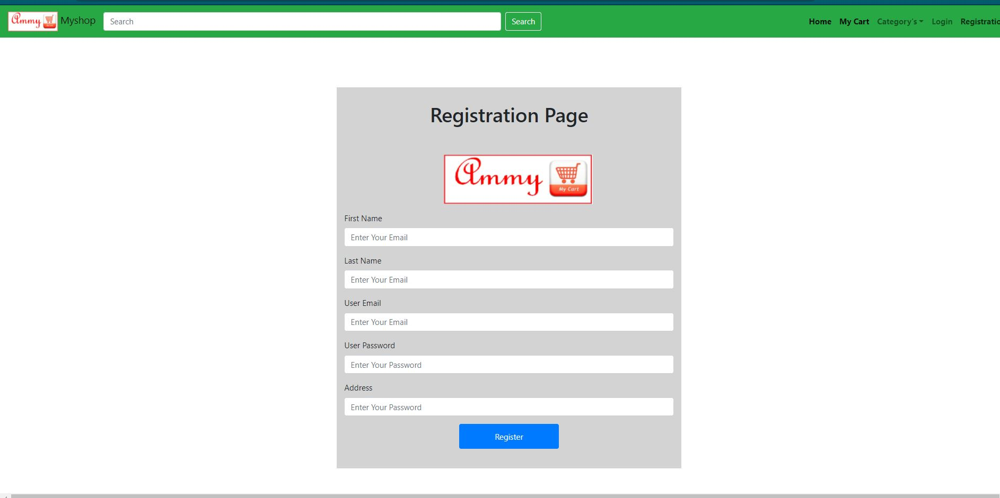
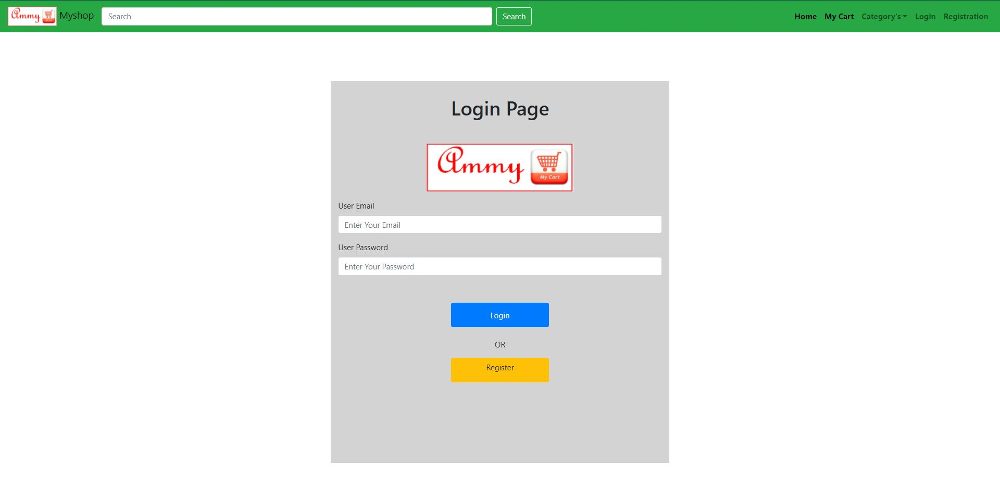
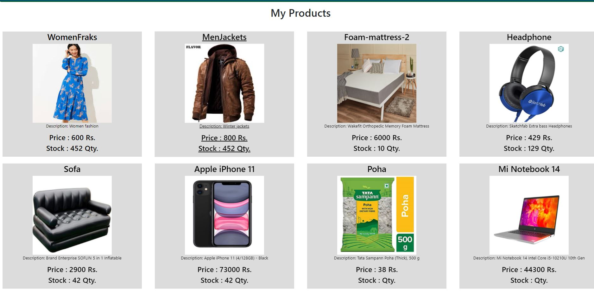

# Myproject

This project was generated with [Angular CLI](https://github.com/angular/angular-cli) version 9.1.9.

## Development server

Run `ng serve` for a dev server. Navigate to `http://localhost:4200/`. The app will automatically reload if you change any of the source files.

## Code scaffolding

Run `ng generate component component-name` to generate a new component. You can also use `ng generate directive|pipe|service|class|guard|interface|enum|module`.

## Build

Run `ng build` to build the project. The build artifacts will be stored in the `dist/` directory. Use the `--prod` flag for a production build.

## Running unit tests

Run `ng test` to execute the unit tests via [Karma](https://karma-runner.github.io).

## Running end-to-end tests

Run `ng e2e` to execute the end-to-end tests via [Protractor](http://www.protractortest.org/).

## Further help

To get more help on the Angular CLI use `ng help` or go check out the [Angular CLI README](https://github.com/angular/angular-cli/blob/master/README.md).
## Get started

### Clone the repo

```shell
git clone https://github.com/bryanforbes/intern-angular
cd intern-angular
```

### Install npm packages

Install the `npm` packages described in the `package.json` and verify that it works:

```shell
npm install
npm start
```

The `npm start` command builds (compiles TypeScript and copies assets) the application into `dist/`, watches for changes to the source files, and runs `lite-server` on port `3000`.

Shut it down manually with `Ctrl-C`.

<h1>#E-Commerce Website</h1>
<h3>Home Page View</h3>

<h3>Registration Page View</h3>

<h3>login Page View</h3>

<h3>Product Page View</h3>

<h3>Single product Page View</h3>

<h3>My Cart Page View</h3>


